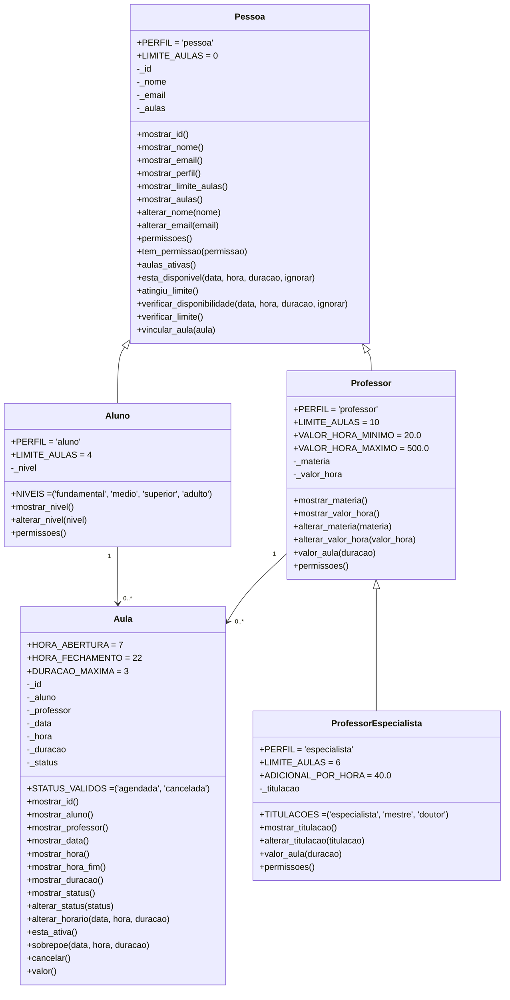

# 🌸 Aulas Particulares API 🌸

API em FastAPI para agendar aulas particulares entre alunos e professores. O projeto mostra uma modelagem simples com herança, polimorfismo, regras de negócio na camada de domínio e separação em `data`, `models`, `controllers` e `routes`.

## Arquitetura do projeto

O projeto foi organizado para separar responsabilidades de forma clara:

- **Domínio**: fica em `app/models`, onde estão as regras de negócio e as entidades principais.
- **Coleções**: ficam em `app/data`, com os mocks usados como fonte de dados em memória.
- **MVC**: os `controllers` fazem a ponte entre os dados e a lógica da aplicação, e as `routes` expõem os endpoints da API.
- **Rotas**: ficam em `app/routes`, organizando os acessos da API de forma separada por recurso.

## O que este projeto faz

- cadastra e lista alunos, professores e aulas a partir de mocks em memória;
- impede conflitos de agenda e respeita limites de aulas por perfil;
- calcula o valor da aula de forma polimórfica;
- expõe a API com documentação automática em `/docs`;

## Estrutura do projeto

```text
aulas-particulares-api/
├── main.py
├── verificar.py
├── requirements.txt
└── app/
    ├── data/
    ├── models/
    ├── controllers/
    └── routes/
```

## Como rodar

No Windows, dentro da pasta do projeto:

```powershell
python -m venv .venv
.venv\Scripts\Activate.ps1
pip install -r requirements.txt
uvicorn main:app --reload
```

Depois abra `http://127.0.0.1:8000/docs`.


## Domínio

### Classes principais

| Classe | Responsabilidade |
|---|---|
| `Pessoa` | base compartilhada por aluno e professor |
| `Aluno` | representa o estudante e seu nível |
| `Professor` | representa o professor e o valor da hora |
| `ProfessorEspecialista` | especialização de professor com adicional por hora |
| `Aula` | liga aluno, professor, data, hora, duração e status |

### Regras de negócio

1. Nome com pelo menos 3 letras e e-mail válido.
2. Nível do aluno entre `fundamental`, `medio`, `superior` e `adulto`.
3. Valor da hora do professor entre R$ 20 e R$ 500.
4. Titulação do especialista entre `especialista`, `mestre` e `doutor`.
5. Aula com duração de 1 a 3 horas, entre 7h e 22h, em uma data válida.
6. Aluno e professor não podem ter duas aulas sobrepostas.
7. Cada perfil tem um limite de aulas ativas.
8. Apenas quem tem permissão `agendar_aula` pode agendar, e apenas quem tem `dar_aula` pode ser professor.
9. Aula cancelada não pode ser cancelada nem remarcada novamente.

## Herança e polimorfismo

- `Pessoa` concentra nome, e-mail, agenda e permissões comuns.
- `Aluno` e `Professor` herdam de `Pessoa` e ajustam limites e permissões.
- `ProfessorEspecialista` herda de `Professor` e altera apenas o cálculo do valor da aula.
- `Aula.valor()` não sabe se o professor é comum ou especialista: ela só chama o método do objeto recebido.

## Rotas da API

| Método | Rota | Finalidade |
|---|---|---|
| GET | `/api/professores` | lista professores |
| GET | `/api/professores/{id}` | busca um professor |
| GET | `/api/professores/materia/{materia}` | filtra por matéria |
| POST | `/api/aulas` | agenda uma aula |
| POST | `/api/aulas/{id}/cancelar` | cancela uma aula |
| GET | `/api/alunos/{id}/aulas` | histórico de aulas de um aluno |
| GET | `/api/relatorio/faturamento` | relatório de faturamento |

## Divisão do trabalho

| Integrante | O que fez |
|---|---|
| Julia Krisnarane | Montou a base inicial do projeto e desenvolveu a estrutura de `app`, os dados de alunos e as models de `Pessoa` e `Aluno`. |
| Nicole Silvestrini | Desenvolveu os mocks de professores e aulas, além das models de `Professor` e `Aula`. |
| Camila Ono | Implementou os controllers e o arquivo de verificação do projeto. |
| Mariana Maia | Estruturou as rotas da API, o arquivo principal da aplicação, as dependências e a documentação. |

## Diagrama de classes



