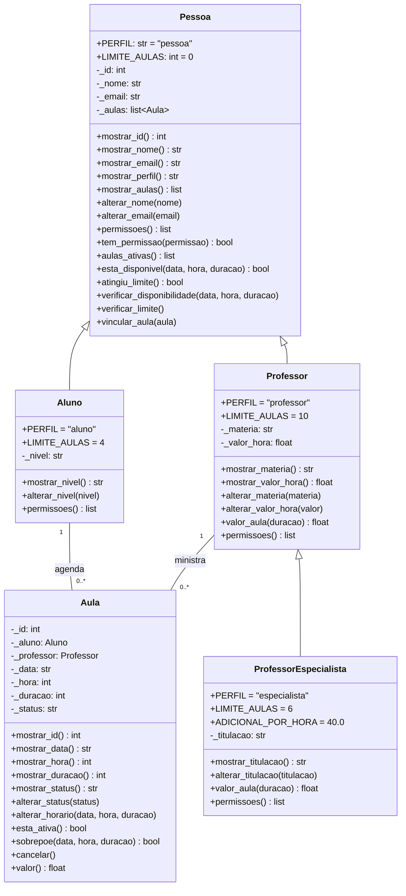

# Aulas Particulares API

Backend de uma plataforma que conecta **alunos** a **professores particulares**: o aluno escolhe um professor, agenda uma aula em um dia e horário, e o sistema cuida de conflitos de agenda, limites de aulas e do valor de cada aula.

Prova em grupo de Programação Orientada a Objetos — arquitetura em quatro camadas (data, models, controllers, routes), seguindo o repositório modelo `kioferta-api`.

## Como rodar

```bash
python -m venv .venv
# Windows: .venv\Scripts\activate   |   Linux/Mac: source .venv/bin/activate
pip install -r requirements.txt
uvicorn main:app --reload
```

Abra **http://127.0.0.1:8000/docs** para testar as rotas.

Para rodar as checagens:

```bash
python verificar.py
```

## O domínio

| Camada | O que existe |
|---|---|
| Hierarquia | `Pessoa` → `Aluno`, `Professor` → `ProfessorEspecialista` |
| Registro que liga | `Aula` guarda um `Aluno` e um `Professor` |
| Entidades com mock | professores, alunos, aulas (6 registros cada) |

São 5 classes. A herança se justifica porque aluno e professor compartilham nome, e-mail, agenda e permissões, e o especialista **é um** professor que só muda o cálculo do valor e o limite de aulas.

### Regras de negócio (todas com `raise ValueError` na model)

1. Nome com pelo menos 3 letras; e-mail com `@` e domínio.
2. Nível do aluno precisa ser `fundamental`, `medio`, `superior` ou `adulto`.
3. Valor da hora do professor entre R$ 20 e R$ 500.
4. Titulação do especialista precisa ser `especialista`, `mestre` ou `doutor`.
5. Aula dura de 1 a 3 horas e acontece entre 7h e 22h; a data precisa existir.
6. Nem o aluno nem o professor podem ter duas aulas sobrepostas.
7. Cada perfil tem um limite de aulas agendadas ao mesmo tempo (`LIMITE_AULAS`): aluno 4, professor 10, especialista 6.
8. Só quem tem a permissão `agendar_aula` agenda, e só quem tem `dar_aula` pode ser o professor.
9. Aula cancelada não pode ser cancelada de novo nem remarcada.

### Herança e polimorfismo

- **Constantes de classe com valor diferente nas filhas:** `PERFIL` e `LIMITE_AULAS`.
- **`super()` estendendo:** `ProfessorEspecialista.valor_aula()` chama `super().valor_aula()` e soma `ADICIONAL_POR_HORA`; `permissoes()` acumula a lista da mãe em cada nível; os construtores das filhas chamam `super().__init__()`.
- **Polimorfismo:** `Aula.valor()` só chama `self._professor.valor_aula(...)` — não sabe se é professor comum ou especialista. Sem ele, seria um `if professor é especialista:` no controller.
- **`PERFIS`:** em `app/models/professor.py`, mapeia o texto `"professor"`/`"especialista"` do mock para a classe.
- **Nenhum `if` de tipo:** até a regra "um aluno não pode ser o professor" é feita por permissão (`tem_permissao("dar_aula")`), não por `isinstance`.

## Diagrama de classes



**Relacionamento:** `Aula` tem uma **associação** com `Aluno` e com `Professor` (1 para muitos). Não é composição: se a aula for cancelada, aluno e professor continuam existindo.

## Rotas

| Método | Rota | O que faz | Códigos |
|---|---|---|---|
| GET | `/api/professores` | lista os professores com o valor da hora | 200 |
| GET | `/api/professores/{id}` | um professor | 200, 404 |
| GET | `/api/professores/materia/{materia}` | filtra por matéria (compreensão de lista) | 200 |
| POST | `/api/aulas` | agenda uma aula | 201, 404, 409, 422 |
| POST | `/api/aulas/{id}/cancelar` | cancela uma aula | 200, 404, 409 |
| GET | `/api/alunos/{id}/aulas` | histórico do aluno | 200, 404 |
| GET | `/api/relatorio/faturamento` | soma das aulas agendadas, total e por professor | 200 |

No `POST /api/aulas`: **404** se o aluno ou o professor não existe; **409** se conflita com a agenda (horário ocupado ou limite atingido); **422** se viola uma regra da model (horário fora do funcionamento, duração inválida, data inexistente).

Exemplo de corpo:

```json
{ "id_aluno": 5, "id_professor": 2, "data": "2026-10-20", "hora": 15, "duracao": 2 }
```

## Estrutura

```
aulas-particulares-api/
├── main.py
├── requirements.txt
├── verificar.py
├── README.md
└── app/
    ├── data/          alunos_mock.py, professores_mock.py, aulas_mock.py
    ├── models/        pessoa.py, aluno.py, professor.py, aula.py
    ├── controllers/   aluno_controller.py, professor_controller.py, aula_controller.py
    └── routes/        aluno_routes.py, professor_routes.py, aula_routes.py
```

## Quem fez o quê

| Integrante | Parte |
|---|---|
| _Nome 1_ | models (`Pessoa`, `Aluno`) e mocks |
| _Nome 2_ | models (`Professor`, `ProfessorEspecialista`, `Aula`) |
| _Nome 3_ | controllers e `verificar.py` |
| _Nome 4_ | routes, README e diagrama |

## Saída do verificar.py

```
=== Encapsulamento e regras de negócio ===
[OK] nome com menos de 3 letras é recusado
[OK] e-mail sem @ é recusado
[OK] nível de aluno inexistente é recusado
[OK] valor da hora fora da faixa é recusado
[OK] aula fora do horário de funcionamento é recusada
[OK] aula com duração maior que 3 horas é recusada
[OK] data inválida é recusada
[OK] professor não pode ter duas aulas sobrepostas
[OK] aula já cancelada não pode ser cancelada de novo
[OK] aluno não passa do LIMITE_AULAS
[OK] atributos são todos protegidos (começam com _)
[OK] nenhuma classe tem alterar_id

=== Herança e polimorfismo ===
[OK] hierarquia Pessoa -> Professor -> ProfessorEspecialista (2 níveis)
[OK] valor_aula do especialista estende o do professor com super()
[OK] permissoes() acumula as da classe mãe
[OK] LIMITE_AULAS tem valor diferente em cada filha
[OK] PERFIS mapeia o texto do mock para a classe
[OK] aula com um aluno no lugar do professor é recusada (permissão, não tipo)

=== Camadas ===
[OK] nenhum import do FastAPI em app/models
[OK] nenhum import em app/data
[OK] nenhum if de tipo ou nome de classe no projeto

=== Controllers ===
[OK] professor inexistente devolve None
[OK] filtro por matéria devolve só aquela matéria
[OK] aulas de aluno inexistente devolve None
[OK] faturamento soma só as aulas agendadas (R$ 840,00 nos mocks)

=== Rotas ===
[OK] as 7 rotas aparecem no /docs

26/26 checagens passaram.
```
